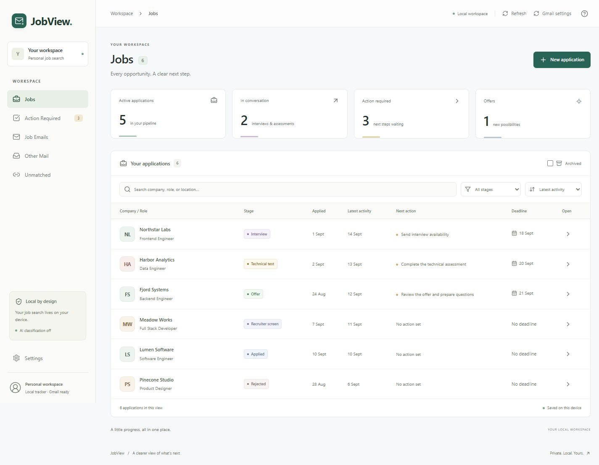
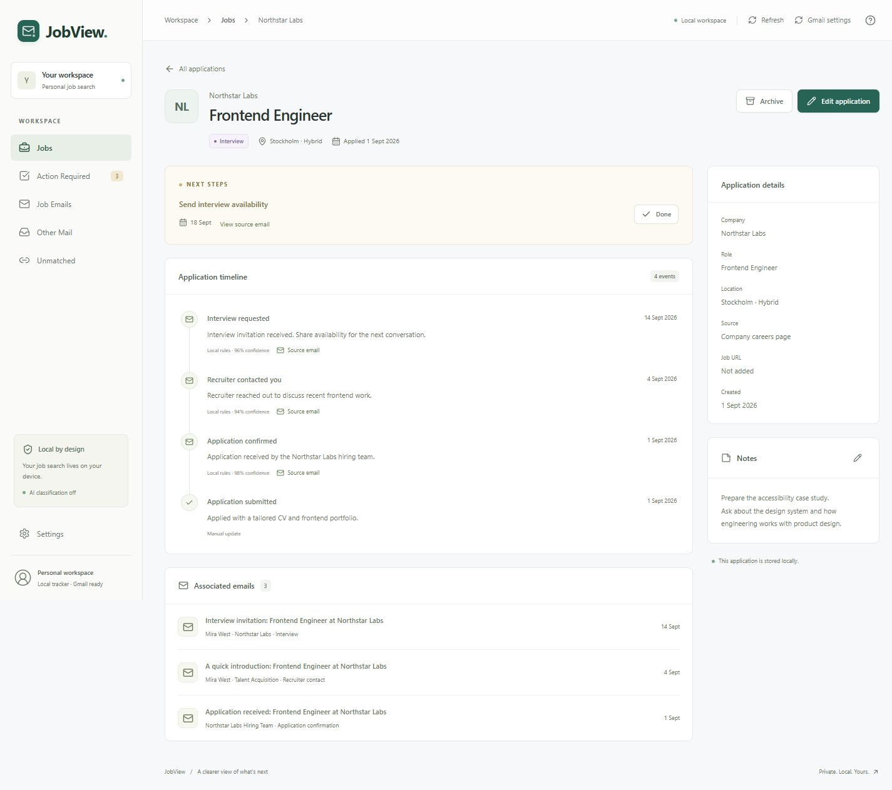

# JobView

**Your job search, with the conversation attached.**

JobView is a Windows desktop application for tracking job applications, next steps, and the emails behind them. Keep your search organized offline, connect Gmail for read-only imports, and review recruitment messages in English or Swedish. Optional Gemini classification helps interpret mail while leaving linking and corrections in your hands.

**Working beta · Windows · Tauri 2 / React / TypeScript / Rust / SQLite**

The tracker and integrations are implemented and covered by automated tests. Live-account acceptance, classification quality on representative mail, and signed installer distribution remain release work.





_Screenshots use fictional demo data. No personal mailbox content is included._

## What you can do

- **Track applications:** create jobs, filter by stage, search, add notes and next actions, and archive or restore applications.
- **Keep the evidence together:** link emails to applications and inspect a persistent timeline of messages, inferred events, and manual changes.
- **Find your next step:** review interview requests, assessments, and other outstanding actions; completed actions remain completed after sync.
- **Import Gmail on demand:** read recent messages, cache them locally, then use incremental sync for later changes. The default first import is 500 messages, configurable from 1 to 5,000.
- **Review recruitment mail:** local English/Swedish rules explain their classifications. Optional Gemini review is Off by default and needs your own API key.
- **Try it without an account:** load the included fictional email fixtures and use the local tracker without Gmail or AI.

JobView never sends, modifies, deletes, labels, archives, or marks Gmail messages read. It has no hosted application backend and does not sync automatically on startup.

## Engineering decisions

| Choice                                                     | Purpose                                                                                                                          |
| ---------------------------------------------------------- | -------------------------------------------------------------------------------------------------------------------------------- |
| Tauri 2 + React + strict TypeScript                        | A native desktop shell with a familiar UI stack and a typed boundary to backend commands.                                        |
| Rust owns storage, rules, and integrations                 | UI components handle presentation; credentials, network requests, and domain changes stay behind narrow commands.                |
| SQLite + SQLx migrations                                   | Jobs and cached evidence remain available offline. Transactions keep associations, events, and stages consistent.                |
| Separate classification, association, and event provenance | A confident email classification does not silently link it to the wrong job. Manual decisions survive sync and reclassification. |
| Injected HTTP and credential adapters                      | Tests exercise OAuth, sync failures, retry bounds, and checkpoint recovery without a personal account.                           |
| Local rules first, AI by opt-in                            | The core workflow needs no API key. AI reviews are bounded, cancellable, validated, and cached by content hash.                  |

See [architecture](docs/architecture.md) for state ownership, sync recovery, and security boundaries, and [classification](docs/classification.md) for local rules and their limits.

## Run on Windows

Install [Node.js](https://nodejs.org/en/download) 22 LTS (22.12+), [Rust stable](https://rust-lang.org/tools/install/), [Visual Studio C++ Build Tools](https://visualstudio.microsoft.com/visual-cpp-build-tools/) with **Desktop development with C++** and a Windows SDK, and [WebView2 Runtime](https://developer.microsoft.com/en-us/microsoft-edge/webview2/#download-section) if absent. See the [Tauri Windows prerequisites](https://tauri.app/start/prerequisites/).

From your checkout in PowerShell:

```powershell
npm.cmd ci
rustup component add rustfmt clippy
npm.cmd run desktop
```

The first build downloads Rust dependencies and can take several minutes. For a standalone executable:

```powershell
npm.cmd run tauri build -- --no-bundle
.\src-tauri\target\release\mailview.exe
```

The executable requires WebView2. JobView retains the internal `mailview` binary name and application identity so existing local data and credentials stay accessible. `npm.cmd run dev` starts a browser preview; native persistence and Gmail require the desktop app.

## Try the fictional workflow

1. Create **Northstar Labs — Frontend Engineer** at **Applied**.
2. Choose **Load fictional emails**; repeated imports do not duplicate mail.
3. Open **Unmatched**, review the Northstar interview message, and link it to your job.
4. Open the job to inspect its timeline. Complete the scheduling request in **Action Required**.
5. Edit a stage, note, or next action, then restart to see the saved state.

Fixtures also cover recruiter outreach, assessments, offers, rejections, newsletters, and receipts. You can create a job directly from an email, ignore unmatched mail, or mark it as not job related.

## Optional integrations

**Gmail:** follow [Gmail setup](docs/gmail-setup.md) to create your own Google OAuth **Desktop app** client. In **Settings**, import its JSON, choose **Connect Gmail**, then **Sync now**. Keep the downloaded file outside the repository. One Gmail account is bound to each local workspace, including after disconnect.

**Gemini:** follow [AI setup and privacy](docs/gemini-setup.md) to save your own key securely and test with fictional text. Choose and save an AI mode before reviewing cached mail. When enabled, AI review also follows successful manual Gmail syncs. Google API usage may incur charges.

## Data and privacy

JobView stores jobs and cached email in a local SQLite database; Settings shows its path. **The database is not encrypted:** it contains readable normalized text and original cached message payloads. Close the app before backing it up and keep backups private.

OAuth client setup, refresh credentials, and the optional Gemini key are stored in Windows Credential Manager. Access tokens stay in backend memory. Disconnect removes local Gmail tokens while preserving setup, cache, jobs, and the account binding; revoke Google's grant separately if needed.

With AI Off, classification runs locally. When enabled, Gemini receives minimized subject, sender, and body text. URLs and email addresses are removed, but names and other personal information may remain. Attachments are not sent. Email renders as text without loading remote images. See [security notes](SECURITY.md) and the [AI payload details](docs/gemini-setup.md#what-leaves-the-computer).

## Development and checks

```powershell
npm.cmd ci
npm.cmd test
npm.cmd run format:check
npm.cmd run build
cargo fmt --manifest-path src-tauri/Cargo.toml --all -- --check
cargo test --manifest-path src-tauri/Cargo.toml --locked
cargo clippy --manifest-path src-tauri/Cargo.toml --all-targets --locked -- -D warnings
npm.cmd run tauri build -- --no-bundle
```

[Windows CI](https://github.com/vilu9169/JobView/actions/workflows/ci.yml) runs these checks without Gmail or Gemini credentials. Tests cover SQLite workflows, manual overrides, OAuth/PKCE, Gmail requests and MIME parsing, partial sync failures, concurrent edits, and AI response handling. Automated coverage does not establish live mailbox accuracy.

See [Contributing](CONTRIBUTING.md) for development conventions, the optional native credential-store test, and release checks. Source is organized under `src/` (React UI and typed IPC), `src-tauri/src/` (Rust domain, repository, services, and integration coordinators), and `src-tauri/migrations/` (SQLite schema).

## Current limitations

- Live Google consent, first mailbox sync, and representative Gemini classifications need acceptance testing with your own accounts. Precision and recall have not been measured.
- Email-to-job associations require a user action; automatic matching suggestions are future work.
- Signed installers, clean-machine installation/upgrade checks, mailbox-scale performance evaluation, and backup/export UI remain outstanding.
- There is one account per workspace; account switching, scheduled sync, attachment handling, and Gmail mutations are outside this beta.

## License

[MIT](LICENSE) · Copyright 2026 Viktor Lundin.
