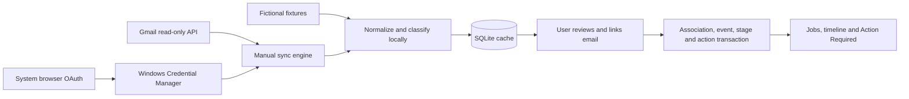

# Architecture

## Boundaries and ownership

React renders local assets in Tauri's webview and calls Rust through a typed IPC adapter. Rust owns domain behavior, SQLite, Google HTTP requests, and credentials. Components manage interaction; selectors and hooks handle derived state and UI snapshots.

SQLite is the source of truth for applications, associations, timelines, notes, corrections, classifications, and cached email. Gmail remains the source of truth for remote content and labels. No Gmail write endpoint exists in the service. Email-to-job links are explicit user actions in this version.

The repository coordinates transactions and embedded SQLx migrations. Pure services implement normalization, classification, stage inference, and conservative matching. The Gmail HTTP adapter and token provider are injected into the sync engine so failures can be tested without an account or network.

## Data model

`emails`, `job_applications`, `application_emails`, `application_events`, and `contacts` hold the tracker. Settings and `sync_metadata` hold preferences and durable sync progress. Foreign keys and unique associations protect integrity; source-email references and provenance make timeline changes inspectable.

Migration 0002 adds account-scoped cache metadata, remote deletion flags, original Gmail MIME payloads, and the completed initial-sync limit. It preserves the original migration and existing user data. Gmail message IDs remain unique across this workspace; a single-account constraint and account validation prevent mixing mailboxes.

Cached emails retain normalized fields, original input, Gmail labels/IDs, timestamps, content hashes, classification metadata, extracted values, and manual/completion flags. Refresh/access tokens, client secrets, and API keys never belong in SQLite. Cached payloads and job records are readable local data.

## Workflow and synchronization

The first sync captures a profile history ID before listing recent messages. Each new message is fetched in full, parsed, normalized, classified locally, and cached. A completed pass records its history checkpoint; a failed pass preserves successful writes and leaves the checkpoint unchanged.

Later sync collects all history pages before applying a change plan. It applies label deltas, retains deleted messages with a remote-deleted marker, and fetches bodies only for uncached mail. Repeated pagination cursors, invalid responses, and history size bounds prevent unbounded loops. A 401 gets one forced token refresh; bounded retries handle transient responses and rate limits while respecting Retry-After.

Expired history (404) triggers a recent scan plus metadata-only reconciliation of all non-deleted cached messages, including older messages outside the limit. Raising the limit performs this scan after processing outstanding history; lowering it does not evict mail. A malformed response cannot advance the checkpoint. Partly broken MIME content falls back through text, HTML, and snippet where possible.

Gmail has its own operation lock and does not hold a database transaction across network awaits. Local CRUD remains available during slow requests. The frontend polls status while connecting/syncing, then queues a workspace refresh behind pending edits, including after partial failure. It preserves edit errors and avoids replacing newer state with an older snapshot.

## Manual decisions and provenance

- Stage edits add a manual event and protect the chosen stage from inferred events.
- Explicit links take precedence over matching. Relinking or marking mail not job related supersedes earlier inferred events while preserving audit records.
- Manual classifications survive reclassification and Gmail sync.
- Completed actions and ignored unmatched messages remain completed/ignored after refresh and rebuild.
- Older confirmations cannot regress a newer stage; terminal stages remain protected.

Classification provenance describes meaning. Association provenance identifies the job. Event provenance records why a timeline changed. Keeping these separate prevents a confident interview classification from becoming an unjustified job match.

## OAuth and security

OAuth imports a Google installed-app configuration through a backend-only native picker with size limits and fixed endpoint validation. Login opens the Windows system browser directly, uses random state and PKCE S256, and temporarily listens on IPv4 loopback with strict callback validation. Sign-in supports cancellation and timeout. API requests reject redirects and bound response sizes. Provider errors become safe local descriptions.

An explicit Windows Credential Manager adapter stores client setup and refresh credentials. Access tokens remain in backend memory. Sensitive owned buffers are zeroized. Unavailable storage fails explicitly and never falls back to files, SQLite, or frontend storage. Disconnect deletes local tokens and preserves setup, cached data, and account binding. Google grant revocation is separate.

Tauri exposes narrow commands. The webview has no general filesystem/shell permissions or direct Google network access. Email bodies render as text; remote content and active HTML are not loaded. Production logs contain application status/error kinds and exclude secrets and email bodies.

## Extension points and validation

The conservative matching service supports a later suggestion workflow; it does not automatically associate mail today. Optional Gemini uses `RemoteClassificationService`, an asynchronous sibling of the deterministic classifier, returning the same `ClassificationResult` type. The coordinator routes candidates using saved privacy modes and local thresholds. It has its own cancellable operation lock and never holds a database transaction during HTTP requests. Saving Off cancels and joins an in-flight operation before acknowledging the change.

Migration 0003 preserves existing settings while permitting Off/Uncertain/Candidates and adds AI configuration, content-hash results, durable attempted hashes, and usage totals. The hash cache is reused across restarts/model changes unless the user explicitly requests fresh results. Applying a result validates it and checks content/manual flags again in a transaction; low-confidence results abstain. Only existing linked-email evidence can affect a job. Local rebuilds preserve Gemini classifications.

The Gemini HTTP service uses a fixed HTTPS endpoint, a sensitive API-key header, no redirects/retries/tools, bounded input/output and timeouts, and strict JSON schema plus semantic validation. Credentials use a distinct key in the existing OS store. The UI briefly sends a masked key through IPC for storage but receives status only. Connection tests use fictional text, including when AI is Off. See [Gemini setup](gemini-setup.md) for the payload, pricing, and failure behavior.

Tests exercise real SQLite transactions, domain rules, Gmail MIME/HTTP behavior, loopback OAuth with simulated token endpoints, refresh/revocation, incremental history, checkpoint safety, partial failures, and concurrent local edits. Windows CI builds the desktop executable. Real Google consent and mailbox acceptance remain separate from deterministic tests. See [release checks](../CONTRIBUTING.md#release-checks).
